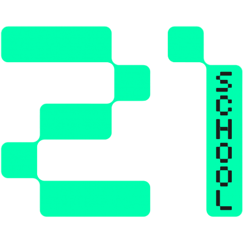
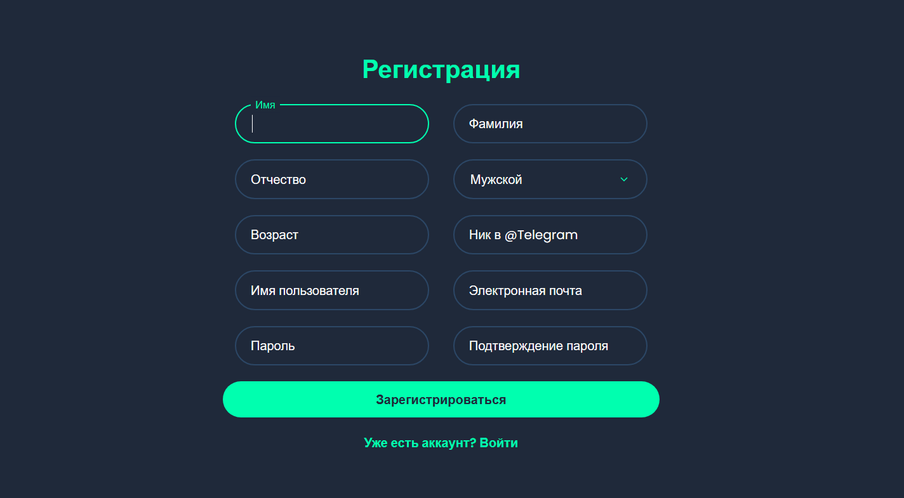
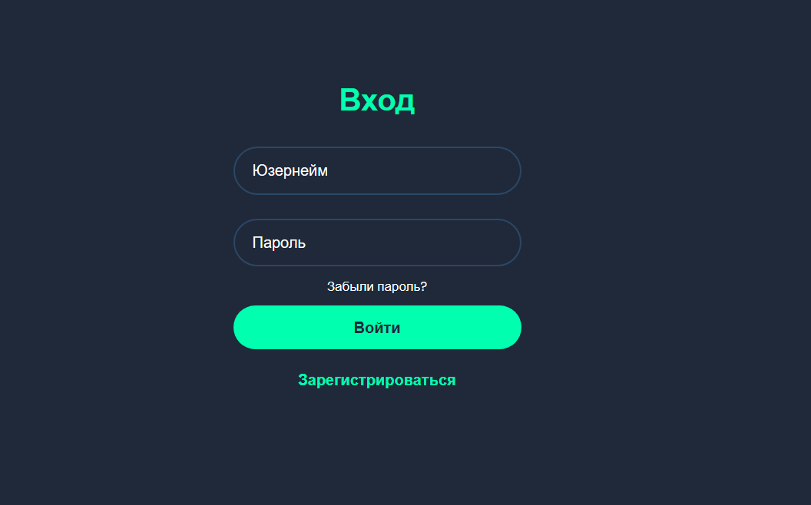
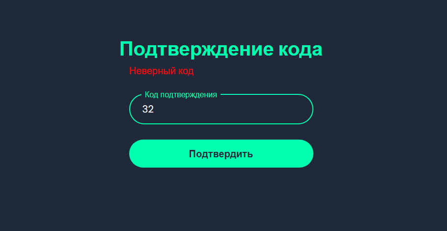
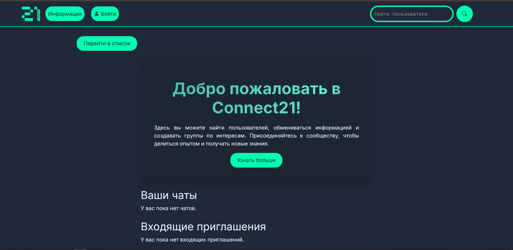
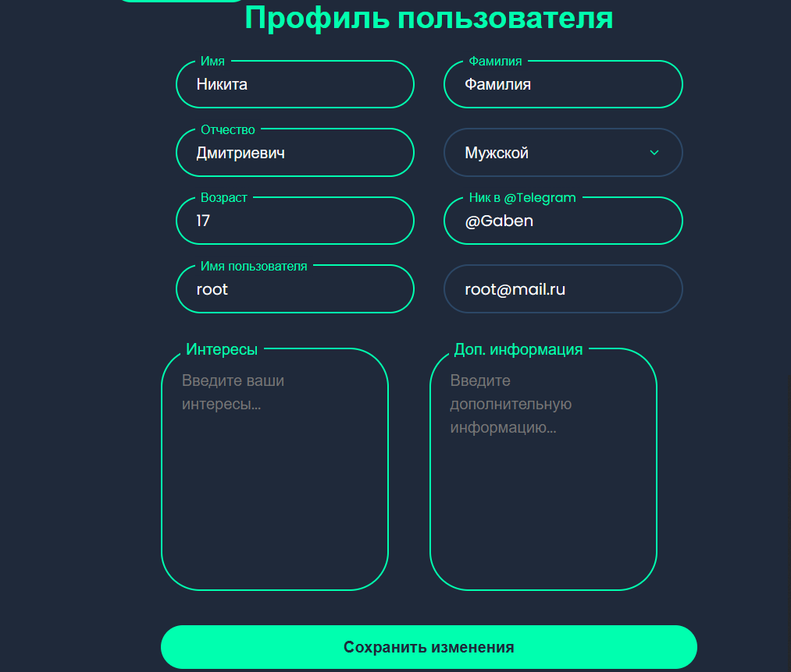
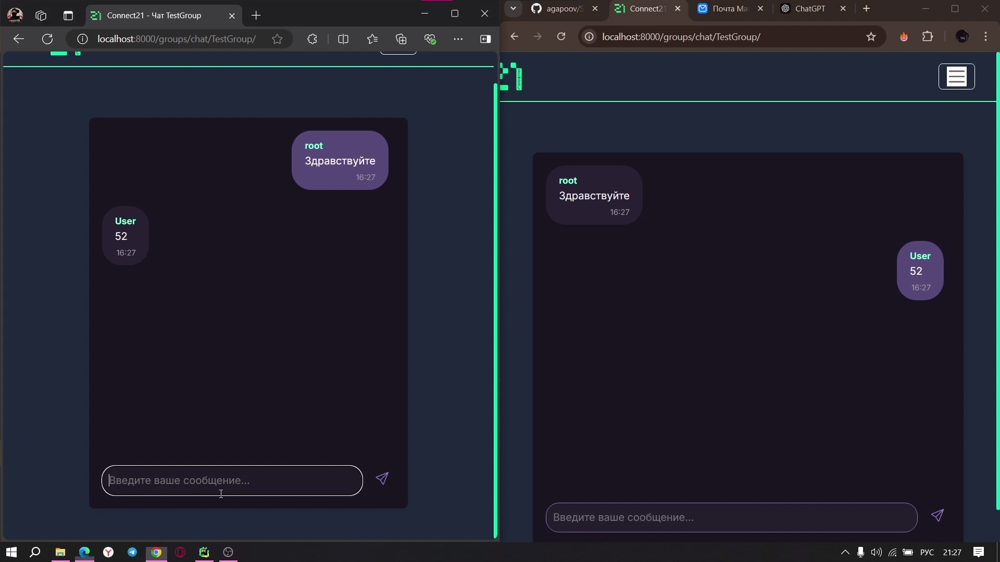

<div align="center">
  
</div>
# Технологический стек проекта


- **Python** — основной язык программирования проекта.
- **Django** — веб-фреймворк, обеспечивающий быстрый и удобный способ разработки веб-приложений.
- **Docker** — для контейнеризации приложения, управления зависимостями и упрощения развёртывания.
- **Nginx** — используется как веб-сервер для обслуживания статических файлов и проксирования запросов на приложение Django
- **Django Channels** — расширение Django для поддержки асинхронной работы и WebSocket-соединений.
- **JavaScript** — используется для работы с WebSocket и динамического обновления элементов интерфейса.
- **CSS** — для оформления внешнего вида и адаптивности веб-страниц.
- **Daphne** — ASGI-сервер, используемый для обработки WebSocket и HTTP/2 соединений.
- **Celery** — использовался для асинхронной отправки почты
- **Redis** — использовался как брокер сообщений для Celery и каналов Django Channels.
- **PostgreSQL** — основная реляционная база данных проекта.


# Инструкция по развертыванию проекта
## Требования

- Docker

## Шаги для установки и запуска проекта

### 1. Клонировать репозиторий

Сначала клонируйте репозиторий на свою машину:

```bash
git clone https://github.com/agapoov/School21.git
cd School21
```

### 2. Создание файла `.env`

В корневой директории проекта скопируйте пример конфигурации `.env.example` в файл `.env`, который будет использоваться для настройки переменных окружения.

```bash
cp .env.example .env
```

### 3. Настройка переменных окружения

Отредактируйте файл `.env` и укажите правильные значения для переменных окружения, таких как имя базы данных, пользователь, пароль и другие настройки.

Пример содержимого `.env`:
```env
DEBUG=False

DATABASE_NAME=<database_name>
DATABASE_USER=<database_owner_name>
POSTGRES_PASSWORD=<your_password>
DATABASE_HOST=db

REDIS_HOST=school21-redis
REDIS_PORT=6379

EMAIL_BACKEND=django.core.mail.backends.smtp.EmailBackend
EMAIL_HOST=smtp.yandex.com
EMAIL_PORT=465
EMAIL_USE_SSL=True
EMAIL_HOST_USER=<your_email@yandex.ru>
EMAIL_HOST_PASSWORD=<your_password_or_app_password>
```

### 4. Сборка и запуск контейнеров

Используйте Docker Compose для сборки и запуска всех контейнеров:

```bash
docker-compose up --build
```

Это создаст и запустит контейнеры для вашего приложения, включая:
- `web`: контейнер для вашего Django-приложения.
- `db`: контейнер с PostgreSQL.
- `redis`: контейнер с Redis для Celery.
- `celery`: контейнер с Celery worker.
- `celery-beat`: контейнер с Celery Beat для планирования задач.
- `nginx`: контейнер для проксирования запросов

### 5. Выполнение миграций и собрание статики

После того как контейнеры запустятся, выполните миграции базы данных:

```bash
docker exec -it school21-web-1 python connect21/manage.py migrate
```

```bash
docker exec -it school21-web-1 python connect21/manage.py collectstatic
```

### 6. Создание суперпользователя

Для создания суперпользователя для админки Django выполните команду:

```bash
docker exec -it school21-web-1 python connect21/manage.py createsuperuser
```

### 7. Открытие проекта

Проект будет доступен по адресу:

```
http://localhost:8000
```

Используйте данные суперпользователя для входа в админку Django.

### 8. Остановка контейнеров

Чтобы остановить контейнеры, выполните:

```bash
docker-compose down
```

## Заметки

- Все переменные окружения, такие как база данных и Redis, настраиваются через файл `.env`.

## Возможности проекта

1. **Двухфакторная аутентификация (2FA)**: 
   - Проект поддерживает двухфакторную аутентификацию по электронной почте для повышения безопасности. При входе в систему пользователи должны ввести код подтверждения, отправленный на их почту, что помогает защитить аккаунты от несанкционированного доступа.

2. **Чат**: 
   - Встроенный чат позволяет пользователям общаться друг с другом в реальном времени. Чат поддерживает отправку текстовых сообщений, а также отображает имя автора сообщения. Это обеспечивает интерактивность и возможность быстрого обмена информацией между пользователями.

3. **Поиск пользователей и сообщений**: 
   - Пользователи могут искать других участников платформы по имени пользователя, полному имени и интересам. Это делает взаимодействие на платформе более удобным, позволяя находить нужных людей и группы по интересам.
## Заключение

Следуя этим шагам, вы сможете успешно развернуть свой проект. Если у вас возникнут вопросы, пишите мне в ТГ: [@agaapov](https://t.me/agaapov).


## Несколько скриншотов проекта






## Лицензия


Этот проект лицензирован под лицензией MIT. См. файл [LICENSE](LICENSE) для получения дополнительной информации.
